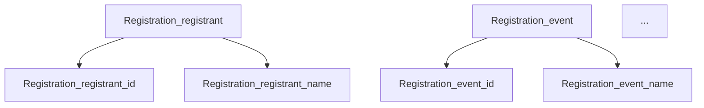

# Schema Visualization Guide

## Overview

The `load_schema_from_openapi_yaml()` function provides comprehensive visualization of the Schema DAG in two complementary views:

1. **Property Hierarchy (Tree View)** - Shows logical structure based on property naming
2. **Constraint Edges (DAG Relationships)** - Shows actual DAG edges that represent constraints

## 1. Property Hierarchy (Tree View)

Shows the logical structure of properties based on their naming conventions, with proper nesting for array items.

### Example Output

```
Schema Structure (Property Hierarchy):
└── Registration
    ├── id [string]
    ├── registrant [reference]
    │   ├── id [string]
    │   ├── name [string]
    │   └── email [string]
    ├── event [reference]
    │   ├── id [string]
    │   ├── name [string]
    │   ├── description [string]
    │   ├── schedule [string]
    │   ├── capacity [integer]
    │   ├── remaining [integer]
    │   └── pricing [number]
    ├── guests [array]
    │   ├── id [string]
    │   ├── name [string]
    │   ├── email [string]
    │   └── invitation [reference]
    │       ├── subject [string]
    │       ├── body [string]
    │       └── send_at [string]
    ├── total_price [number]
    └── status [string]
```

### Key Features

- **Proper Array Nesting**: Array items like `guests[*].name` appear as children of the `guests` array
- **Type Annotations**: Each property shows its type in brackets: `[string]`, `[integer]`, `[reference]`, `[array]`
- **Hierarchical Display**: Nested objects show clear parent-child relationships
- **Unicode Tree Characters**: Clean, readable tree structure using `├──`, `└──`, `│`

### What It Shows

- **Logical Organization**: How properties are organized in the schema
- **"Contains" Relationships**: Which properties contain other properties
- **Data Types**: The type of each property
- **Schema Structure**: Easy-to-understand overview of the data model

## 2. Constraint Edges (DAG Relationships)

Shows the actual DAG edges that represent how properties constrain each other.

### Example Output

```
Constraint Edges (DAG relationships):
  1. Registration.registrant → Registration.registrant.id
     (registrant constrains id)
  2. Registration.registrant → Registration.registrant.name
     (registrant constrains name)
  3. Registration.registrant → Registration.registrant.email
     (registrant constrains email)
  4. Registration.event → Registration.event.id
     (event constrains id)
  5. Registration.event → Registration.event.name
     (event constrains name)
  ...
  13. Registration.guests[*].invitation → Registration.guests[*].invitation.send_at
     (invitation constrains send_at)
```

### Key Features

- **Full Property Paths**: Shows complete property IDs for precision
- **Abbreviated Explanations**: Shows short names in parentheses for readability
- **Numbered List**: Easy to reference specific edges
- **Arrow Notation**: Clear `→` shows direction of constraint

### What It Shows

- **Constraint Dependencies**: How properties depend on each other
- **Execution Order**: The order in which properties must be validated/generated
- **Actual DAG Structure**: The real graph edges, not just naming conventions

## Understanding the Difference

### Tree View = Logical Structure

**Based on**: Property naming conventions (dots in property names)

**Shows**: "Contains" relationships

**Example**: `guests` contains `name`
```
└── guests [array]
    └── name [string]
```

### Edge List = Constraint Dependencies

**Based on**: Actual DAG edges created from parent-child relationships

**Shows**: Which property constrains which

**Example**: `guests[*]` constrains `name` (name depends on guests[*])
```
Registration.guests[*] → Registration.guests[*].name
```

### Why Both?

- **Tree View**: Easy to understand the schema organization
- **Edge List**: Shows the actual computational dependencies

## Mermaid Diagram Export

A complete graph visualization is automatically saved to `{filename}_schema_diagram.md`:



### Renders In

- ✅ VS Code Markdown Preview
- ✅ GitHub
- ✅ GitLab
- ✅ Confluence (with Mermaid plugin)
- ✅ Any Mermaid-compatible viewer

### File Contents

The generated file includes:
- Schema metadata (filename, root entity, property count, edge count)
- Complete Mermaid graph with all nodes and edges
- Proper node IDs for linking

## Usage Examples

### Default Behavior (With Visualization)

```python
from langstate.readers.yaml_to_schema import load_schema_from_openapi_yaml

# Loads schema and prints both tree view and edge list
schema = load_schema_from_openapi_yaml('api.yaml')
```

**Output**: Full visualization to console + Mermaid diagram saved

### Silent Mode (No Visualization)

```python
# Suppress visualization for automated scripts
schema = load_schema_from_openapi_yaml('api.yaml', visualize=False)
```

**Output**: No console output, no file saved (for tests/scripts)

### Programmatic Access

```python
# Access the DAG structure programmatically
for node_id, node in schema.nodes.items():
    prop = node.value
    print(f"Property: {node_id}")
    print(f"  Type: {prop.constraints[0].property_type.allowed if prop.constraints else 'N/A'}")
    print(f"  Depends on: {list(node.depends_on)}")
    print(f"  Required by: {list(node.required_by)}")
```

## Benefits

### 1. Immediate Understanding
See the schema structure at a glance without reading YAML

### 2. Debugging
Quickly identify:
- Missing properties
- Incorrect relationships
- Circular dependencies
- Type mismatches

### 3. Documentation
Auto-generated diagrams for:
- API documentation
- Developer onboarding
- Architecture reviews
- Design discussions

### 4. Validation
Verify that:
- All properties are present
- Constraints are correctly modeled
- Dependencies make sense
- Array items are properly structured

### 5. Planning
Understand before implementing:
- Dependency chains
- Property generation order
- Validation sequences
- Data flow

## Array Handling

### Problem

In OpenAPI, array items use `[*]` notation: `guests[*].name`

This could be ambiguous in a tree view - should it be a sibling or child?

### Solution

We normalize the notation in the tree view:
- `guests[*].name` → appears under `guests` in the tree
- The `guests` property is marked with `[array]`
- Edge list shows the actual `guests[*]` → `guests[*].name` relationship

### Example

**Property IDs** (in code):
```
Registration.guests
Registration.guests[*].id
Registration.guests[*].name
```

**Tree View** (logical hierarchy):
```
└── guests [array]
    ├── id [string]
    └── name [string]
```

**Edge List** (actual DAG):
```
Registration.guests[*] → Registration.guests[*].id
Registration.guests[*] → Registration.guests[*].name
```

This gives you:
- ✅ Clean tree visualization
- ✅ Accurate DAG representation
- ✅ No confusion between the two

## Customization

### Disable Visualization Globally

```python
# For all your tests
import langstate.readers.yaml_to_schema as loader
loader.load_schema = lambda doc, **kw: loader.load_schema_from_openapi_yaml(doc, visualize=False, **kw)
```

### Custom Visualization

```python
schema = load_schema_from_openapi_yaml('api.yaml', visualize=False)

# Use DAG methods directly
print(schema.to_json_dict())  # JSON format
print(schema.to_ascii_tree())  # ASCII tree
print(schema.to_mermaid())     # Mermaid diagram
```

## Tips

### 1. Use in Development
Keep `visualize=True` during development to catch issues early

### 2. Disable in Tests
Use `visualize=False` in automated tests to avoid cluttered output

### 3. Review Diagrams
Check the generated Mermaid diagram into version control for documentation

### 4. Compare Changes
Diff the Mermaid diagrams to see how the schema evolved

### 5. Validate Structure
Use the edge list to verify parent-child relationships are correct

## Troubleshooting

### Tree Not Showing?

Check that properties follow dot notation: `Entity.property.subproperty`

### Edges Not Showing?

Check that edges were created during schema loading (parent → child relationships)

### Mermaid File Not Saved?

Check file permissions and that the directory exists

### Array Items Not Nested?

Verify the property IDs use `[*]` notation correctly

## See Also

- [README_YAML_TO_SCHEMA.md](README_YAML_TO_SCHEMA.md) - Main documentation
- [VISUALIZATION.md](../VISUALIZATION.md) - DAG visualization API reference
- [NOTES.md](NOTES.md) - aiopenapi3 reference behavior notes
