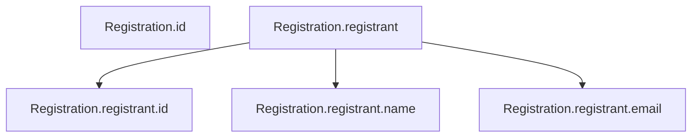

# Schema Visualization Examples

This document shows examples of the automatic visualization features in `yaml_to_schema.py`.

## Basic Usage with Visualization

```python
from langstate.readers.yaml_to_schema import load_schema_from_openapi_yaml

# Load schema - automatically shows visualization
schema = load_schema_from_openapi_yaml('registeration.yaml')
```

### Output

```
================================================================================
Schema loaded from: registeration.yaml
Root entity: Registration
Properties: 23
Edges: 13
================================================================================

Schema Structure (Tree View):
├── Registration.id [string]
├── Registration.registrant [reference]
│   ├── Registration.registrant.email [string]
│   ├── Registration.registrant.id [string]
│   └── Registration.registrant.name [string]
├── Registration.event [reference]
│   ├── Registration.event.capacity [integer]
│   ├── Registration.event.description [string]
│   ├── Registration.event.remaining [integer]
│   ├── Registration.event.pricing [number]
│   ├── Registration.event.name [string]
│   ├── Registration.event.schedule [string]
│   └── Registration.event.id [string]
├── Registration.guests [array]
├── Registration.guests[*].id [string]
├── Registration.guests[*].name [string]
├── Registration.guests[*].email [string]
├── Registration.guests[*].invitation [reference]
│   ├── Registration.guests[*].invitation.body [string]
│   ├── Registration.guests[*].invitation.send_at [string]
│   └── Registration.guests[*].invitation.subject [string]
├── Registration.total_price [number]
└── Registration.status [string]

Mermaid diagram saved to: registeration_schema_diagram.md
```

## Silent Mode

If you don't want visualization output (e.g., in automated scripts):

```python
# Load without visualization
schema = load_schema_from_openapi_yaml('registeration.yaml', visualize=False)
# No output printed - works silently
```

## Understanding the Visualization

### Tree View Features

- **Property Types**: Shown in brackets after each property name
  - `[string]` - Text fields
  - `[integer]` - Whole numbers
  - `[number]` - Decimal numbers
  - `[boolean]` - True/False values
  - `[array]` - Collections
  - `[reference]` - References to other objects

- **Hierarchy**: Indentation shows parent-child relationships
  - Properties are nested under their parent objects
  - Array items use `[*]` notation (e.g., `guests[*].name`)

- **Edges**: The tree structure represents structural edges (parent → child)

### Statistics Summary

```
Properties: 23  ← Total number of Property nodes
Edges: 13       ← Total number of parent→child relationships
```

## Mermaid Diagram

A Mermaid diagram file is automatically saved alongside your YAML file:

```
your-file.yaml                    ← Your OpenAPI spec
your-file_schema_diagram.md       ← Generated Mermaid diagram
```

### Viewing the Mermaid Diagram

1. **GitHub**: Push to GitHub and view the .md file - Mermaid renders automatically
2. **VS Code**: Install "Markdown Preview Mermaid Support" extension
3. **Online**: Copy the mermaid code to https://mermaid.live/

### Example Mermaid Output



## Programmatic Access

After loading, you can access the schema programmatically:

```python
schema = load_schema_from_openapi_yaml('registeration.yaml')

# Access properties by ID
reg_id = schema.nodes['Registration.id'].value
print(f"Property: {reg_id.id}")
print(f"Type: {reg_id.constraints[0].property_type.allowed}")

# Get all properties
for node in schema.nodes.values():
    prop = node.value
    print(f"{prop.id}: {len(prop.constraints)} constraints")

# Get topological order
for prop_id in schema.topological_order():
    print(prop_id)

# Export to JSON
json_data = schema.to_json_dict()
print(json_data)
```

## Comparison: Schema vs State

| Feature | Schema | State |
|---------|--------|-------|
| **What it shows** | Property definitions | Runtime instances |
| **Node type** | `Property` | `PropertyInstance` |
| **Node ID** | Property.id | UUID |
| **Visualization** | Structure + types | Structure + constraints |
| **Edges** | Structural only | Structural + x-sup |

## Customization

### Manual Visualization

You can also generate visualizations manually:

```python
# Load silently
schema = load_schema_from_openapi_yaml('api.yaml', visualize=False)

# Custom node labeling
def custom_label(prop: Property) -> str:
    return f"{prop.info.name} ({prop.id})"

# Generate ASCII tree
tree = schema.to_ascii_tree(node_label_fn=custom_label)
print(tree)

# Generate Mermaid
mermaid = schema.to_mermaid(
    node_label_fn=lambda p: p.id,
    max_label_length=40
)
print(mermaid)

# Export to JSON
json_dict = schema.to_json_dict()
```

## Use Cases

### 1. Understanding Schema Structure
```python
# Quick overview of your API structure
schema = load_schema_from_openapi_yaml('api.yaml')
# View tree to understand relationships
```

### 2. Documentation Generation
```python
# Generate diagrams for documentation
schema = load_schema_from_openapi_yaml('api.yaml')
# Use the generated Mermaid diagram in your docs
```

### 3. Schema Validation
```python
# Check schema is correctly structured
schema = load_schema_from_openapi_yaml('api.yaml')
print(f"Found {len(schema.nodes)} properties")
print(f"Root properties: {[n for n in schema.nodes if '.' not in n]}")
```

### 4. Automated Testing
```python
# In tests, suppress output
schema = load_schema_from_openapi_yaml('api.yaml', visualize=False)
assert len(schema.nodes) == 23
assert 'Registration.id' in schema.nodes
```

## Tips

1. **Large Schemas**: For schemas with 100+ properties, the tree view can be long. Consider using `visualize=False` and accessing specific properties programmatically.

2. **CI/CD**: Set `visualize=False` in automated pipelines to avoid cluttering logs.

3. **Debugging**: Enable visualization to quickly spot missing properties or incorrect relationships.

4. **Documentation**: Commit the generated `*_schema_diagram.md` files to your repository for automatic rendering on GitHub.
