# State Graph Diagram: Registration

Generated from: `registeration.yaml`

## Statistics
- **Nodes**: 23 PropertyInstances
- **Edges**: 28 ConstraintInstances
  - Structural edges: 13
  - X-sup edges: 15

## Diagram

```mermaid
graph TD
    084acdf2_9836_4fbc_a28f_fdeeec2e8f56["Registration.id"]
    2eccbe83_29a1_4d23_aa88_a4b6fa1250d2["Registration.registrant.id"]
    efbb6666_cf05_4547_904c_4b6fcdf4149e["Registration.registrant.name"]
    73fe2717_e921_4313_b8fc_9195be45bcf8["Registration.registrant.email"]
    057e28f9_dcb7_4741_9a6b_8240bacda056["Registration.registrant"]
    f426ed19_c228_4f30_84c3_21b9c0a2b286["Registration.event.id"]
    0648f100_a7ad_4e74_80f5_657339a1effb["Registration.event.name"]
    d95571b5_5997_42d9_8178_52b9c86df398["Registration.event.description"]
    fea047d9_4b6a_4e7e_9987_9ed284b2ec05["Registration.event.schedule"]
    6ccbb56a_fdc4_41e3_86a8_26c91d914800["Registration.event.capacity"]
    3b58048d_73cb_4d93_a83f_f4a6e099f508["Registration.event.remaining"]
    8ccb8f0a_05c3_40ab_9cae_9b0b38864e50["Registration.event.pricing"]
    8abe24db_6dcd_497e_8146_bebd243032a8["Registration.event"]
    c59ebd7d_28e3_4c4c_bf77_7391d3c00dab["Registration.guests"]
    2367bfd0_488e_40e0_8760_750cd98da8dc["Registration.guests[*].id"]
    ec0f63dd_8e79_4001_bd9d_567523b799a5["Registration.guests[*].name"]
    86f8ae0e_daac_4388_b2e1_6ff6046e8025["Registration.guests[*].email"]
    c1436954_89cb_4b2d_b4b4_c9ff6ecf6f56["Registration.guests[*].invitation.subject"]
    8a0df173_44f7_459f_bbaf_0dd9b88ecb63["Registration.guests[*].invitation.body"]
    39011dee_ba0d_4430_97b7_cbd9e4a40115["Registration.guests[*].invitation.send_at"]
    a3195508_45c7_4040_bfd1_5017c7c6b127["Registration.guests[*].invitation"]
    237abff2_3c36_4d8c_82da_5460c0eacc1d["Registration.total_price"]
    d7b3a487_bab7_4e27_b920_88cab723eaa1["Registration.status"]
    057e28f9_dcb7_4741_9a6b_8240bacda056 -->|structural| 2eccbe83_29a1_4d23_aa88_a4b6fa1250d2
    057e28f9_dcb7_4741_9a6b_8240bacda056 -->|structural| efbb6666_cf05_4547_904c_4b6fcdf4149e
    057e28f9_dcb7_4741_9a6b_8240bacda056 -->|structural| 73fe2717_e921_4313_b8fc_9195be45bcf8
    8abe24db_6dcd_497e_8146_bebd243032a8 -->|structural| f426ed19_c228_4f30_84c3_21b9c0a2b286
    8abe24db_6dcd_497e_8146_bebd243032a8 -->|structural| 0648f100_a7ad_4e74_80f5_657339a1effb
    8abe24db_6dcd_497e_8146_bebd243032a8 -->|structural| d95571b5_5997_42d9_8178_52b9c86df398
    8abe24db_6dcd_497e_8146_bebd243032a8 -->|structural| fea047d9_4b6a_4e7e_9987_9ed284b2ec05
    8abe24db_6dcd_497e_8146_bebd243032a8 -->|structural| 6ccbb56a_fdc4_41e3_86a8_26c91d914800
    8abe24db_6dcd_497e_8146_bebd243032a8 -->|structural| 3b58048d_73cb_4d93_a83f_f4a6e099f508
    8abe24db_6dcd_497e_8146_bebd243032a8 -->|structural| 8ccb8f0a_05c3_40ab_9cae_9b0b38864e50
    057e28f9_dcb7_4741_9a6b_8240bacda056 -->|xsup:validated| 8abe24db_6dcd_497e_8146_bebd243032a8
    8abe24db_6dcd_497e_8146_bebd243032a8 -->|xsup:edited| 2367bfd0_488e_40e0_8760_750cd98da8dc
    057e28f9_dcb7_4741_9a6b_8240bacda056 -->|xsup:validated| 2367bfd0_488e_40e0_8760_750cd98da8dc
    8abe24db_6dcd_497e_8146_bebd243032a8 -->|xsup:edited| ec0f63dd_8e79_4001_bd9d_567523b799a5
    057e28f9_dcb7_4741_9a6b_8240bacda056 -->|xsup:validated| ec0f63dd_8e79_4001_bd9d_567523b799a5
    8abe24db_6dcd_497e_8146_bebd243032a8 -->|xsup:edited| 86f8ae0e_daac_4388_b2e1_6ff6046e8025
    057e28f9_dcb7_4741_9a6b_8240bacda056 -->|xsup:validated| 86f8ae0e_daac_4388_b2e1_6ff6046e8025
    a3195508_45c7_4040_bfd1_5017c7c6b127 -->|structural| c1436954_89cb_4b2d_b4b4_c9ff6ecf6f56
    8abe24db_6dcd_497e_8146_bebd243032a8 -->|xsup:edited| c1436954_89cb_4b2d_b4b4_c9ff6ecf6f56
    057e28f9_dcb7_4741_9a6b_8240bacda056 -->|xsup:validated| c1436954_89cb_4b2d_b4b4_c9ff6ecf6f56
    a3195508_45c7_4040_bfd1_5017c7c6b127 -->|structural| 8a0df173_44f7_459f_bbaf_0dd9b88ecb63
    8abe24db_6dcd_497e_8146_bebd243032a8 -->|xsup:edited| 8a0df173_44f7_459f_bbaf_0dd9b88ecb63
    057e28f9_dcb7_4741_9a6b_8240bacda056 -->|xsup:validated| 8a0df173_44f7_459f_bbaf_0dd9b88ecb63
    a3195508_45c7_4040_bfd1_5017c7c6b127 -->|structural| 39011dee_ba0d_4430_97b7_cbd9e4a40115
    8abe24db_6dcd_497e_8146_bebd243032a8 -->|xsup:edited| 39011dee_ba0d_4430_97b7_cbd9e4a40115
    057e28f9_dcb7_4741_9a6b_8240bacda056 -->|xsup:validated| 39011dee_ba0d_4430_97b7_cbd9e4a40115
    8abe24db_6dcd_497e_8146_bebd243032a8 -->|xsup:edited| a3195508_45c7_4040_bfd1_5017c7c6b127
    057e28f9_dcb7_4741_9a6b_8240bacda056 -->|xsup:validated| a3195508_45c7_4040_bfd1_5017c7c6b127
```

## Legend

- **Structural edges**: Parent → Child property relationships (auto-generated)
- **X-sup edges**: Explicit constraint dependencies from x-sup extensions
- **Node labels**: Property IDs (e.g., `Registration.event.name`)

## Notes

This diagram shows the dependency graph where:
- Each node is a PropertyInstance with a unique UUID
- Edges represent ConstraintInstances (dependencies)
- Arrow direction: prerequisite → dependent
