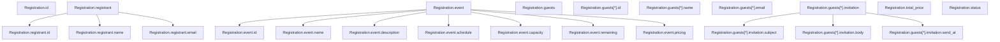

# Schema Diagram

Generated from: `registeration.yaml`

```mermaid
graph TD
    Registration_id["Registration.id"]
    Registration_registrant_id["Registration.registrant.id"]
    Registration_registrant_name["Registration.registrant.name"]
    Registration_registrant_email["Registration.registrant.email"]
    Registration_registrant["Registration.registrant"]
    Registration_event_id["Registration.event.id"]
    Registration_event_name["Registration.event.name"]
    Registration_event_description["Registration.event.description"]
    Registration_event_schedule["Registration.event.schedule"]
    Registration_event_capacity["Registration.event.capacity"]
    Registration_event_remaining["Registration.event.remaining"]
    Registration_event_pricing["Registration.event.pricing"]
    Registration_event["Registration.event"]
    Registration_guests["Registration.guests"]
    Registration_guests_star__id["Registration.guests[*].id"]
    Registration_guests_star__name["Registration.guests[*].name"]
    Registration_guests_star__email["Registration.guests[*].email"]
    Registration_guests_star__invitation_subject["Registration.guests[*].invitation.subject"]
    Registration_guests_star__invitation_body["Registration.guests[*].invitation.body"]
    Registration_guests_star__invitation_send_at["Registration.guests[*].invitation.send_at"]
    Registration_guests_star__invitation["Registration.guests[*].invitation"]
    Registration_total_price["Registration.total_price"]
    Registration_status["Registration.status"]
    Registration_registrant --> Registration_registrant_id
    Registration_registrant --> Registration_registrant_name
    Registration_registrant --> Registration_registrant_email
    Registration_event --> Registration_event_id
    Registration_event --> Registration_event_name
    Registration_event --> Registration_event_description
    Registration_event --> Registration_event_schedule
    Registration_event --> Registration_event_capacity
    Registration_event --> Registration_event_remaining
    Registration_event --> Registration_event_pricing
    Registration_guests_star__invitation --> Registration_guests_star__invitation_subject
    Registration_guests_star__invitation --> Registration_guests_star__invitation_body
    Registration_guests_star__invitation --> Registration_guests_star__invitation_send_at
```
